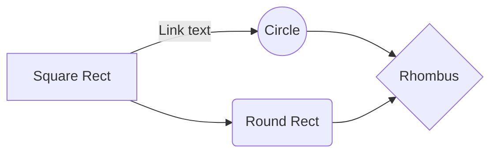

## Chain of Responsibility

### Concept:
* Decoupling of sender and receiver
* promotes loose coupling
* Receiver knows the next receiver without knowing the herarcy
* Examples

### Example:
`javax.servelet.Filter#doFilter()`,
`Spring Security Filter Chain`

## Command

### Concept:
* Encapsulates request as an object
* object oriented callback
* Decouples sender from processor
* Examples

### Example:
`java.lang.Runnable`,

## Interpreter

### Concept:
* Represents Grammar
* Interpret a sentence
* AST
* Map a domain

### Example:
`java.util.Pattern`,
`java.text.Format`,

## Interator

### Concept:
* Traverse a container
* Doesn't expose underlying structure
* Decouples the Algorithm
* Sequential- Always in order

### Example:
`java.util.Iterator`,
`java.util.Enumeration`,

## Mediator

### Concept:
* Loose Coupling
* Reusable Component

### Example:
`java.util.Timer`,
`java.lang.reflect,Method#invoke()`,

## Memento

### Concept:
* used for rollback/ undo functionality
* Restore Object to previous state
* Shield complex Internals
* More Memory required

### Example:
`java.util.Date`,
`java.io.Serializable`,

## Observer

### Concept:
* One to Many
* Pub/Sub( synchronous)
* Decoupled
* Event Handling

### Example:
`java.util.Observer`,
`java.util.EventListner`,
`java.jms.Topic`

### Sample MD flow diagram

